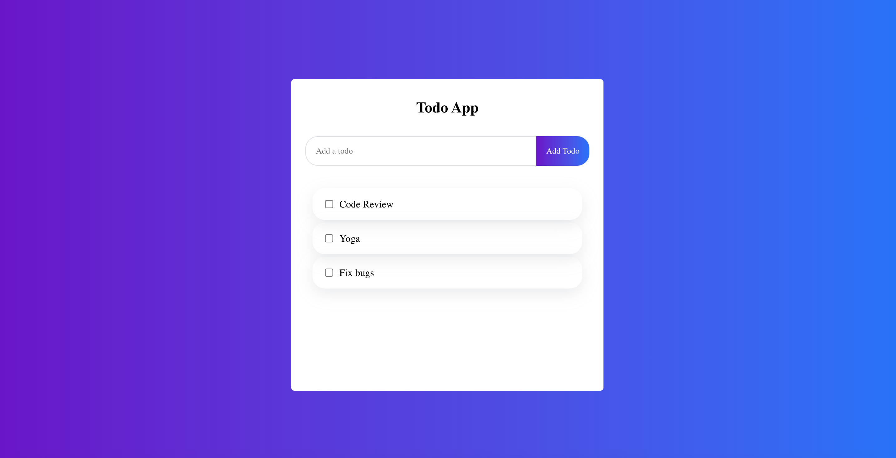

# TypeScript Tutorial

Get quickly started with TypeScript by building a Todo App.
This project is built using [TypeScript and React](https://create-react-app.dev/docs/adding-typescript/)

For a video tutorial, watch [this video on YouTube](https://www.youtube.com/watch?v=BUh12mwkH_8&t=677s)

## Available Scripts

In the project directory, you can run:

### `npm install`

To install dev dependencies.

### `npm start`

Runs the app in the development mode.\
Open [http://localhost:3000](http://localhost:3000) to view it in the browser.

The page will reload if you make edits.\
You will also see any lint errors in the console.
